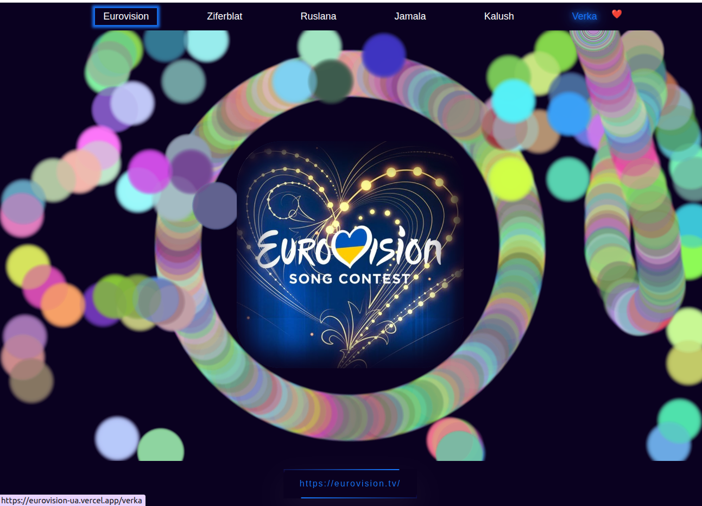
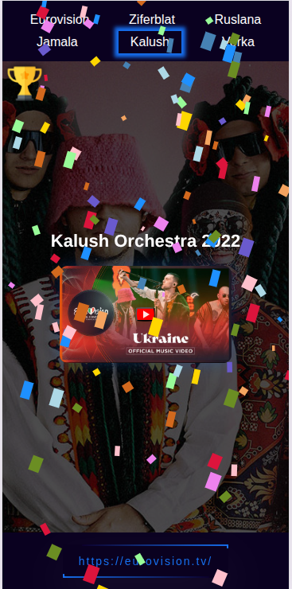

# 🎤 Eurovision-UA

A bright, bold and celebratory **single-page app** dedicated to Ukraine's winners of the Eurovision Song Contest. Built as a React-based tribute to the music, culture, and victories of Ukraine in one of the world’s most colorful events.

🔗 **Live demo**: [https://eurovision-ua.vercel.app/](https://eurovision-ua.vercel.app/)

---

## 🎯 Purpose
This project was built as a visual playground — to study and apply modern CSS trends like neumorphism and glassmorphism in a creative, non-functional interface. It's part of my personal exploration in UI design and frontend presentation.

---

## ✨ Highlights

- 🇺🇦 Showcases Ukraine’s Eurovision champions
- 🌈 Vibrant, high-contrast design — **intentionally bright** to match Eurovision energy
- ⚛️ Built with **React**, fully responsive
- 🎭 UI emphasizes celebration, pop-culture, and movement
- 🧠 Simple codebase, ideal for thematic microsites or front-end demos

---

## 🧑‍💻 Tech Stack

- **React**
- **CSS3** (custom layout + color themes)
- **Vite**
- **Deployed with Vercel**

---

## 📸 Screenshots

| Desktop | Mobile |
|---------|--------|
|  |  |


---

## 🚀 Local Setup

```bash
git clone https://github.com/marrozhkova/eurovision-ua.git
cd eurovision-ua
npm install
npm run dev
```
## 👤 Author

**Maryna Rozhkova**  
Frontend Developer | Learner by Heart  
📫 [mar.rozhkova@gmail.com](mailto:mar.rozhkova@gmail.com)  
🌐 [Portfolio](https://marrozhkova-portfolio.vercel.app/)
